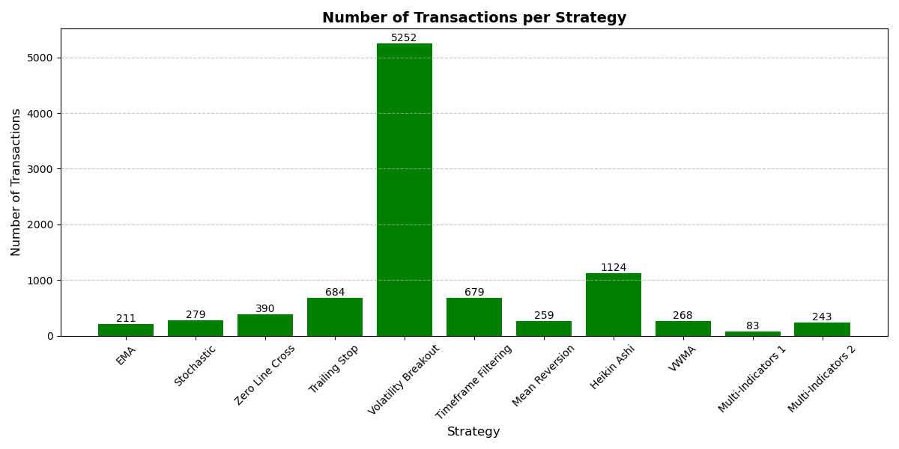

# strategiesVsMutualFund
Optimizing Investment Outcomes: A Comparative Analysis of Technical Indicator-Based Stock Trading Strategies vs. Mutual Fund Performance
# Optimizing Investment Outcomes: Technical Indicator-Based Stock Trading Strategies

## Overview
This project evaluates nine widely recognized technical indicator-based trading strategies and compares their performance against the TD Bank NASDAQ Index Mutual Fund (TDB981). Implemented in Python, the study focuses on metrics such as win rate, average return, and risk to derive actionable insights for investors.

## Features
- Implementation of nine technical indicator-based trading strategies:
  - Exponential Moving Average (EMA)
  - Stochastic Oscillator
  - Moving Average Convergence Divergence (MACD)
  - Trailing Stop
  - Volatility Breakout
  - Timeframe Filtering
  - Mean Reversion
  - Heikin Ashi
  - Volume Weighted Moving Average (VWMA)
- Performance metrics: Average return, Sharpe ratio, cumulative return, win rate, and risk.
- Backtesting for historical data from 2014–2023 using Python libraries like `pandas` and `matplotlib`.
## Data Sources
- Stock data: Yahoo Finance
- Mutual fund data: TD Bank NASDAQ Index Mutual Fund reports.

## Methodology
1. **Data Sourcing**:
   - Stock data for 10 companies: Apple, NVIDIA, Microsoft, Tesla, etc.
   - Mutual fund data from TD Bank’s NASDAQ Index Mutual Fund (TDB981).
2. **Data Preprocessing**:
   - Cleaning and structuring the data for analysis.
3. **Analysis**:
   - Exploratory Data Analysis (EDA).
   - Strategy implementation and backtesting.

## Limitations
- Transaction costs not included in the backtesting.
- Results based on historical data; future performance may vary.

## Visualization
Below are sample visualizations generated during the project:

1. **Average Return**
   

2. **Cumulative Returns Comparison**
   

3. **Number of Transactions**
   

4. **Risk Level Comparison**
   

## Results
- The **EMA strategy** achieved the highest average return of 23.42%, outperforming mutual funds in most years.
- Trend-following strategies were effective in bullish markets.
- Mean-reverting strategies provided stability during market consolidations.

